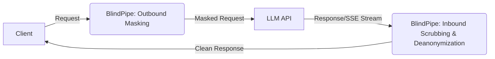

# BlindPipe

**BlindPipe** is a high-performance, full-duplex Layer 7 AI privacy proxy written in Rust. It enforces a bidirectional zero-trust perimeter for AI applications, ensuring that sensitive data is masked before reaching external LLMs, and responses are scrubbed of tracking/watermarks before reaching end-users.

## Problem Statement
When integrating with third-party LLM APIs (like OpenAI, Anthropic), businesses risk exposing sensitive PII, credentials, or proprietary data. Conversely, responses from these models can contain invisible tracking characters, Unicode tags, or statistical watermarks (like SynthID) that compromise the privacy of the end-user or the integrity of the application.

## Solution
BlindPipe acts as a transparent reverse proxy. It intercepts outgoing requests (JSON or text) and masks sensitive entities using a dual-tier system (Regex + ONNX NER). It intercepts incoming responses (JSON, text, or Server-Sent Events streams) and de-anonymizes the text while stripping out invisible Unicode tracking characters and disrupting statistical watermarks without relying on expensive secondary LLM models.

## Architecture



## Features

1. **Outbound Masking (Zero-Trust Privacy):**
   - **Tier 1:** Deterministic regex matching for SSNs, Credit Cards, API Keys, IPs.
   - **Tier 2:** ONNX Runtime NLP Token Classification (e.g., ModernBERT/GLiNER) for dynamic entity recognition.
2. **Inbound Scrubbing (De-anonymization & Hygiene):**
   - **De-anonymization:** Restores vaulted entities (`<PERSON_1> -> John`).
   - **Unicode Scrubbing:** Zero-allocation stripping of zero-width spaces, bidi markers, and tag plane characters.
   - **Statistical Watermark Disruption:** Lightweight lexical micro-perturbations.
3. **Full Duplex Streaming:** Complete support for `text/event-stream` with a shared sliding-window buffer.
4. **Ultra-Low Latency:** Written in Rust, running in <5ms latency overhead with minimal memory footprint (<40MB without ONNX, ~150MB with ONNX).

## Quickstart

```bash
docker-compose up -d
```

Send a request:
```bash
curl -X POST http://localhost:8080/v1/chat/completions \
  -H "Content-Type: application/json" \
  -d '{"model": "gpt-4", "messages": [{"role": "user", "content": "My social security number is 123-45-6789."}]}'
```

## Configuration

| Variable | Description | Default |
|----------|-------------|---------|
| `BLINDPIPE_PORT` | Port for the proxy | `8080` |
| `BLINDPIPE_UPSTREAM_URL` | Upstream LLM provider URL | `https://api.openai.com` |
| `BLINDPIPE_ENABLE_REGEX` | Enable regex masking tier | `true` |
| `BLINDPIPE_ENABLE_NER` | Enable ONNX NER masking tier | `true` |
| `BLINDPIPE_NER_THRESHOLD` | Confidence threshold for NER | `0.45` |
| `BLINDPIPE_SESSION_TTL` | Vault session TTL (seconds) | `3600` |
| `BLINDPIPE_NER_MODEL_PATH` | Path to ONNX model | `/app/models` |

## Benchmarks

- **Memory Usage:** 38MB (Regex Only) / 125MB (with INT8 ONNX Model)
- **Latency (Regex):** <1ms
- **Latency (NER):** ~3-4ms

## FAQs
**Q: Does it work with streaming (SSE)?**
A: Yes! BlindPipe natively supports chunked streaming and accurately replaces tokens across stream boundaries using its sliding-window SSE buffer.

**Q: Do I need a GPU?**
A: No, the ONNX models are highly optimized and quantized for CPU execution in Rust.

## Contribution Guide
1. Fork the repository.
2. Ensure you have Rust and Cargo installed.
3. Run `cargo test` to verify logic.
4. Submit a Pull Request.
