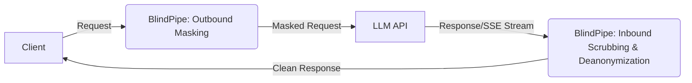

# BlindPipe

[](https://github.com/TamTunnel/BlindPipe/actions/workflows/docker-build.yml)
[](https://www.rust-lang.org)
[](https://opensource.org/licenses/Apache-2.0)

**BlindPipe** is a high-performance, full-duplex Layer 7 AI privacy proxy written in Rust. It enforces a bidirectional zero-trust perimeter for AI applications, ensuring that sensitive data is masked before reaching external LLMs, and responses are scrubbed of tracking/watermarks before reaching end-users. It redacts outbound PII/credentials and purges inbound zero-width tracking characters, SynthID watermarks, and C2PA/EXIF metadata across 13 image, document, and markup formats.

**BlindPipe is provider agnostic and hence can work with any LLM provider with their upstream API URL.**

## The Problem: Bi-Directional AI Surveillance

1. **Outbound Data Exfiltration:** Sending proprietary code, credentials, and customer PII to cloud LLMs violates compliance (GDPR/HIPAA/SOC2) and exposes sensitive data to external logging.
2. **Inbound Traceability & Synthetic Watermarks:** Major AI providers (Anthropic, Google, OpenAI) are rolling out traceable markers—including statistical n-gram biasing (SynthID, Kirchenbauer green-lists), zero-width Unicode characters, bidi overrides, and C2PA metadata—to comply with regulatory mandates (such as the EU AI Act). These invisible signatures embed persistent provenance into generated text, code, and documents, allowing third parties to trace and fingerprint your outputs.

*AI providers and enterprise agents embed persistent provenance markers (C2PA JUMBF containers, EXIF/XMP headers, `/Metadata` streams, and `docProps/` archives) into generated images, code artifacts, and exported files, allowing permanent lineage tracking and device attribution.*

## The Solution: BlindPipe

**BlindPipe** acts as an invisible, full-duplex Layer 7 security boundary. BlindPipe inspects both streaming text and inline Base64 / binary media on the fly without writing files to disk:
* **Outbound (Client → LLM):** Intercepts requests, redacts PII and credentials using high-speed deterministic regex and local ONNX NER, and stores mappings in an ephemeral, in-memory vault.
* **Inbound (LLM → Client):** Re-hydrates original PII while simultaneously stripping zero-width tracking characters, normalizing Unicode homoglyphs, disrupting statistical watermark distributions, and purging provenance metadata in real time with $< 4\text{ms}$ latency overhead.

## Architecture



## Features

### Supported Formats & Stripping Matrix

| Category | Formats | Stripped Signatures & Provenance Markers | Technical Engine |
| :--- | :--- | :--- | :--- |
| **Text Streams** | `text/plain`, `text/event-stream` | Zero-width spaces (`\u{200B}`–`\u{FEFF}`), Bidi overrides, Tag plane (`\u{E0000}`), SynthID n-gram biases | Zero-allocation character filter + Lexical perturbation |
| **Raster Images** | **PNG, JPEG, WebP, GIF, BMP, TIFF** | `caTX` (C2PA), `APP11` (JUMBF boxes), `APP1` (EXIF/XMP), `eXIf`, `iTXt`, comment extensions | Zero-copy byte marker / chunk filter |
| **Vector Images** | **SVG** | `<metadata>`, `<rdf:RDF>`, C2PA tags, XML comments | XML AST / Regex sanitizer |
| **Documents** | **PDF** | `/Metadata` object streams, `/PieceInfo`, `/Info` dictionary attribution (`/Author`, `/Creator`, `/Producer`) | Pure-Rust `lopdf` AST nullifier |
| **Containers** | **DOCX, EPUB, ODT** | `docProps/core.xml`, `docProps/app.xml`, `docProps/custom.xml`, `meta.xml`, embedded C2PA manifests | In-memory `zip` archive repacker |
| **Markup** | **HTML, Markdown** | `<meta name="generator">`, `<meta name="author">`, `data-ai-*` tracking attributes, YAML/TOML frontmatter | Streaming markup parser |

1. **Outbound Masking (Zero-Trust Privacy):**
   - **Tier 1:** Deterministic regex matching for SSNs, Credit Cards, API Keys, IPs.
   - **Tier 2:** ONNX Runtime NLP Token Classification (e.g., ModernBERT/GLiNER) for dynamic entity recognition.
2. **Inbound Scrubbing (De-anonymization & Hygiene):**
   - **De-anonymization:** Restores vaulted entities (`<PERSON_1> -> John`).
   - **Unicode Scrubbing:** Zero-allocation stripping of zero-width spaces, bidi markers, and tag plane characters.
   - **Statistical Watermark Disruption:** Lightweight lexical micro-perturbations.
3. **Full Duplex Streaming:** Complete support for `text/event-stream` with a shared sliding-window buffer.
4. **Ultra-Low Latency:** Written in Rust, running in <5ms latency overhead with minimal memory footprint (<40MB without ONNX, ~150MB with ONNX).

## Quickstart

You can run BlindPipe directly using the pre-built Docker image, or build it locally from source.

### Option 1: Use Pre-built Image (Recommended)
```bash
docker run -d -p 8080:8080 \
  -e BLINDPIPE_UPSTREAM_URL=https://api.openai.com \
  ghcr.io/tamtunnel/blindpipe:latest
```

### Option 2: Build Locally (For Power Users)
```bash
git clone https://github.com/TamTunnel/BlindPipe.git
cd BlindPipe
docker-compose up -d
```

### Schema-Agnostic Engine
BlindPipe uses a recursive JSON walker that processes arbitrary payload structures without manual schema configuration. This makes it intrinsically compatible with **any** REST or SSE LLM provider out-of-the-box.

### Sending Requests (Multi-Provider Examples)

BlindPipe is completely provider-agnostic. Just set `BLINDPIPE_UPSTREAM_URL` to your provider's base endpoint and pass their specific headers through the proxy.

**OpenAI:**
```bash
# Start proxy pointing to OpenAI
docker run -d -p 8080:8080 -e BLINDPIPE_UPSTREAM_URL=https://api.openai.com ghcr.io/tamtunnel/blindpipe:latest

# Send request
curl -X POST http://localhost:8080/v1/chat/completions \
  -H "Content-Type: application/json" \
  -H "Authorization: Bearer $OPENAI_API_KEY" \
  -d '{"model": "gpt-4", "messages": [{"role": "user", "content": "My social security number is 123-45-6789."}]}'
```

**Anthropic (Claude):**
```bash
# Start proxy pointing to Anthropic
docker run -d -p 8080:8080 -e BLINDPIPE_UPSTREAM_URL=https://api.anthropic.com ghcr.io/tamtunnel/blindpipe:latest

# Send request
curl -X POST http://localhost:8080/v1/messages \
  -H "Content-Type: application/json" \
  -H "x-api-key: $ANTHROPIC_API_KEY" \
  -H "anthropic-version: 2023-06-01" \
  -d '{"model": "claude-3-opus-20240229", "max_tokens": 1024, "messages": [{"role": "user", "content": "My secret key is sk-12345678901234567890123456789012"}]}'
```

**OpenRouter:**
```bash
# Start proxy pointing to OpenRouter
docker run -d -p 8080:8080 -e BLINDPIPE_UPSTREAM_URL=https://openrouter.ai ghcr.io/tamtunnel/blindpipe:latest

# Send request
curl -X POST http://localhost:8080/api/v1/chat/completions \
  -H "Content-Type: application/json" \
  -H "Authorization: Bearer $OPENROUTER_API_KEY" \
  -d '{"model": "meta-llama/llama-3-8b-instruct:free", "messages": [{"role": "user", "content": "My email is user@example.com."}]}'
```

**Local Ollama:**
```bash
# Start proxy pointing to local Ollama (assuming it's on the host machine)
docker run -d -p 8080:8080 -e BLINDPIPE_UPSTREAM_URL=http://host.docker.internal:11434 ghcr.io/tamtunnel/blindpipe:latest

# Send request
curl -X POST http://localhost:8080/api/generate \
  -H "Content-Type: application/json" \
  -d '{"model": "llama3", "prompt": "My IP address is 192.168.1.100", "stream": false}'
```

### Inline Base64 & Multipart Verification Example

```bash
# Example: Sending a request that generates an inline image/artifact
curl http://localhost:8080/v1/images/generations \
  -H "Authorization: Bearer $OPENAI_API_KEY" \
  -H "Content-Type: application/json" \
  -d '{"prompt": "A modern logo design", "response_format": "b64_json"}'
# BlindPipe intercepts the b64_json field, strips C2PA/EXIF chunks in memory, and returns clean Base64.
```

### IDE & Developer Tool Integrations

BlindPipe operates as a transparent Layer 7 proxy. You do not need to install custom plugins, load prompt skills, or configure agent tools. Simply point your tool's **Base URL** to BlindPipe.

#### Cursor IDE
1. Open **Cursor Settings** (`Cmd + Shift + J` or `Ctrl + Shift + J`).
2. Navigate to **Models** → **OpenAI API Key** (or custom endpoint).
3. Toggle **Override OpenAI Base URL** and enter:
   ```text
   http://localhost:8080/v1
   ```
4. Enter your upstream API key in the key field (BlindPipe forwards authorization headers transparently).

#### VS Code Extensions (Cline / Roo Code / Continue.dev)
1. Open extension settings.
2. Set **API Provider** to `OpenAI Compatible` (or `Anthropic Compatible`).
3. Set **Base URL** to `http://localhost:8080/v1`.
4. Enter your real upstream provider API key.

#### Terminal Coding Agents (Aider / OpenDevin / Goose)
Pass standard environment variables directly in your shell:

```bash
# OpenAI / OpenRouter
export OPENAI_BASE_URL="http://localhost:8080/v1"
export OPENAI_API_KEY="sk-..."

# Anthropic
export ANTHROPIC_BASE_URL="http://localhost:8080"
export ANTHROPIC_API_KEY="sk-ant-..."

# Launch agent
aider
```

#### Python / TypeScript SDKs

```python
from openai import OpenAI

client = OpenAI(
    base_url="http://localhost:8080/v1",
    api_key="your-api-key"
)
```

## Why BlindPipe (L7 Proxy) vs. Prompt Skills (`skills.md`)

| Feature / Metric | Agent Skill (`skills.md` / Tools) | BlindPipe (L7 Network Proxy) |
| :--- | :--- | :--- |
| **Context Window Overhead** | Consumes **500–1,500 prompt tokens** on every turn | **0 tokens** (Operates entirely outside the context window) |
| **Enforcement Reliability** | **Probabilistic** (Model may hallucinate, skip tool calls, or ignore instructions) | **100% Deterministic** (Hard network-level byte filtering) |
| **Outbound PII Protection** | **None** (Prompts and secrets leave plaintext before the skill runs) | **Full-Duplex** (Masks outbound PII *before* leaving localhost) |
| **Inbound Watermark Hygiene** | Requires manual post-generation re-prompting or tool execution | **Automatic** (Strips zero-width tags & C2PA inline on stream deltas) |
| **Compatibility** | Locked to specific agent platforms supporting that skill syntax | **Universal** (Works with Cursor, Cline, Aider, SDKs, cURL) |
| **Prompt Injection Risk** | Vulnerable to context poisoning and adversarial prompt override | **Immune** (Runs in compiled Rust runtime outside the LLM sandbox) |
| **Streaming Latency** | High (Must buffer full completion before invoking Python tool) | **Sub-4ms P99** (SIMD-accelerated real-time SSE chunk pipeline) |

## Configuration

| Variable | Description | Default |
|----------|-------------|---------|
| `BLINDPIPE_PORT` | Port for the proxy | `8080` |
| `BLINDPIPE_UPSTREAM_URL` | Upstream LLM provider URL | `https://api.openai.com` |
| `BLINDPIPE_ENABLE_REGEX` | Enable regex masking tier | `true` |
| `BLINDPIPE_ENABLE_NER` | Enable ONNX NER masking tier | `true` |
| `BLINDPIPE_NER_THRESHOLD` | Confidence threshold for NER | `0.45` |
| `BLINDPIPE_SESSION_TTL` | Vault session TTL (seconds) | `3600` |
| `BLINDPIPE_NER_MODEL_PATH` | Path to ONNX model | `/app/models` |

## Benchmarks

- **Memory Usage:** 38MB (Regex Only) / 125MB (with INT8 ONNX Model)
- **Latency (Regex):** <1ms
- **Latency (NER):** ~3-4ms

## Frequently Asked Questions (FAQ)

#### Can BlindPipe run on resource-constrained embedded devices (e.g., OpenWrt / GL.iNet routers)?
**Yes.** By default, BlindPipe compiles with the `ner` feature enabled (which bundles ONNX Runtime for contextual named entity recognition). If you are deploying to a low-resource environment (like an OpenWrt router, Raspberry Pi, or embedded gateway) with limited storage or RAM, compile BlindPipe without default features:

```bash
# Compiles a tiny, standalone ~10MB static binary (Regex-only mode)
cargo build --release --no-default-features
```

* **Memory Footprint:** Drops from $\approx 42\text{ MB}$ to **$< 15\text{ MB}$ RSS**.
* **Capabilities:** Tier 1 deterministic redaction (API keys, SSNs, credit cards, emails, IPs) + full inbound Unicode/watermark stripping without requiring any external `.onnx` model weights.

#### What is the Latency Impact?
BlindPipe is built for high-performance and minimal latency overhead. SIMD-accelerated character scanning and in-memory Aho-Corasick unmasking maintain sub-5ms P99 proxy overhead, ensuring that adding BlindPipe to your stack doesn't slow down upstream interactions.

#### Is Session Data Private?
**Yes.** All surrogate-to-real token mappings are stored in-memory using an LRU/TTL cache and are never written to disk, guaranteeing strong session privacy.

## Contribution Guide
1. Fork the repository.
2. Ensure you have Rust and Cargo installed.
3. Run `cargo test` to verify logic.
4. Submit a Pull Request.
