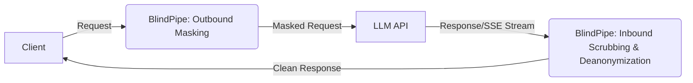

# BlindPipe

[](https://github.com/TamTunnel/BlindPipe/actions/workflows/docker-build.yml)
[](https://www.rust-lang.org)
[](https://opensource.org/licenses/Apache-2.0)

**BlindPipe** is a high-performance, full-duplex Layer 7 AI privacy proxy written in Rust. It enforces a bidirectional zero-trust perimeter for AI applications, ensuring that sensitive data is masked before reaching external LLMs, and responses are scrubbed of tracking/watermarks before reaching end-users.

## The Problem: Bi-Directional AI Surveillance

1. **Outbound Data Exfiltration:** Sending proprietary code, credentials, and customer PII to cloud LLMs violates compliance (GDPR/HIPAA/SOC2) and exposes sensitive data to external logging.
2. **Inbound Traceability & Synthetic Watermarks:** Major AI providers (Anthropic, Google, OpenAI) are rolling out traceable markers—including statistical n-gram biasing (SynthID, Kirchenbauer green-lists), zero-width Unicode characters, bidi overrides, and C2PA metadata—to comply with regulatory mandates (such as the EU AI Act). These invisible signatures embed persistent provenance into generated text, code, and documents, allowing third parties to trace and fingerprint your outputs.

## The Solution: BlindPipe

**BlindPipe** acts as an invisible, full-duplex Layer 7 security boundary:
* **Outbound (Client → LLM):** Intercepts requests, redacts PII and credentials using high-speed deterministic regex and local ONNX NER, and stores mappings in an ephemeral, in-memory vault.
* **Inbound (LLM → Client):** Re-hydrates original PII while simultaneously stripping zero-width tracking characters, normalizing Unicode homoglyphs, disrupting statistical watermark distributions, and purging provenance metadata in real time with $< 4\text{ms}$ latency overhead.

## Architecture



## Features

1. **Outbound Masking (Zero-Trust Privacy):**
   - **Tier 1:** Deterministic regex matching for SSNs, Credit Cards, API Keys, IPs.
   - **Tier 2:** ONNX Runtime NLP Token Classification (e.g., ModernBERT/GLiNER) for dynamic entity recognition.
2. **Inbound Scrubbing (De-anonymization & Hygiene):**
   - **De-anonymization:** Restores vaulted entities (`<PERSON_1> -> John`).
   - **Unicode Scrubbing:** Zero-allocation stripping of zero-width spaces, bidi markers, and tag plane characters.
   - **Statistical Watermark Disruption:** Lightweight lexical micro-perturbations.
3. **Full Duplex Streaming:** Complete support for `text/event-stream` with a shared sliding-window buffer.
4. **Ultra-Low Latency:** Written in Rust, running in <5ms latency overhead with minimal memory footprint (<40MB without ONNX, ~150MB with ONNX).

## Quickstart

You can run BlindPipe directly using the pre-built Docker image, or build it locally from source.

### Option 1: Use Pre-built Image (Recommended)
```bash
docker run -d -p 8080:8080 \
  -e BLINDPIPE_UPSTREAM_URL=https://api.openai.com \
  ghcr.io/tamtunnel/blindpipe:latest
```

### Option 2: Build Locally (For Power Users)
```bash
git clone https://github.com/TamTunnel/BlindPipe.git
cd BlindPipe
docker-compose up -d
```

Send a request:
```bash
curl -X POST http://localhost:8080/v1/chat/completions \
  -H "Content-Type: application/json" \
  -d '{"model": "gpt-4", "messages": [{"role": "user", "content": "My social security number is 123-45-6789."}]}'
```

## Configuration

| Variable | Description | Default |
|----------|-------------|---------|
| `BLINDPIPE_PORT` | Port for the proxy | `8080` |
| `BLINDPIPE_UPSTREAM_URL` | Upstream LLM provider URL | `https://api.openai.com` |
| `BLINDPIPE_ENABLE_REGEX` | Enable regex masking tier | `true` |
| `BLINDPIPE_ENABLE_NER` | Enable ONNX NER masking tier | `true` |
| `BLINDPIPE_NER_THRESHOLD` | Confidence threshold for NER | `0.45` |
| `BLINDPIPE_SESSION_TTL` | Vault session TTL (seconds) | `3600` |
| `BLINDPIPE_NER_MODEL_PATH` | Path to ONNX model | `/app/models` |

## Benchmarks

- **Memory Usage:** 38MB (Regex Only) / 125MB (with INT8 ONNX Model)
- **Latency (Regex):** <1ms
- **Latency (NER):** ~3-4ms

## Frequently Asked Questions (FAQ)

#### Can BlindPipe run on resource-constrained embedded devices (e.g., OpenWrt / GL.iNet routers)?
**Yes.** By default, BlindPipe compiles with the `ner` feature enabled (which bundles ONNX Runtime for contextual named entity recognition). If you are deploying to a low-resource environment (like an OpenWrt router, Raspberry Pi, or embedded gateway) with limited storage or RAM, compile BlindPipe without default features:

```bash
# Compiles a tiny, standalone ~10MB static binary (Regex-only mode)
cargo build --release --no-default-features
```

* **Memory Footprint:** Drops from $\approx 42\text{ MB}$ to **$< 15\text{ MB}$ RSS**.
* **Capabilities:** Tier 1 deterministic redaction (API keys, SSNs, credit cards, emails, IPs) + full inbound Unicode/watermark stripping without requiring any external `.onnx` model weights.

#### What is the Latency Impact?
BlindPipe is built for high-performance and minimal latency overhead. SIMD-accelerated character scanning and in-memory Aho-Corasick unmasking maintain sub-5ms P99 proxy overhead, ensuring that adding BlindPipe to your stack doesn't slow down upstream interactions.

#### Is Session Data Private?
**Yes.** All surrogate-to-real token mappings are stored in-memory using an LRU/TTL cache and are never written to disk, guaranteeing strong session privacy.

## Contribution Guide
1. Fork the repository.
2. Ensure you have Rust and Cargo installed.
3. Run `cargo test` to verify logic.
4. Submit a Pull Request.
